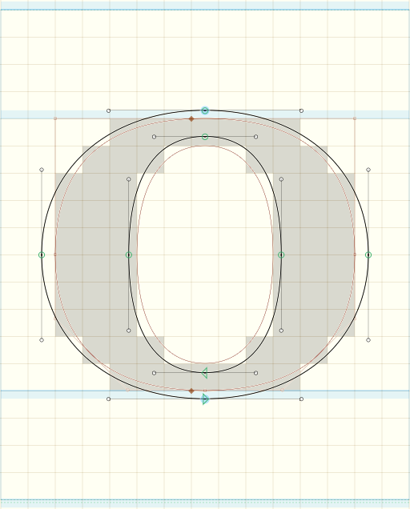

# Aliased Pixel Preview for Glyphs

Show a black and white pixel rendering of the current glyph. It uses the TrueType fill
algorithm: If the center of a pixel is inside the shape, the pixel is filled.

Activate the plugin via _View – Show Aliased Pixel Preview._



The pixel grid is controlled by the same setting as in Glyphs’ built-in Pixel Preview.

To change the grid, activate the built-in Pixel Preview _(View – Show Pixel Preview),_
then right-click in a glyph editor and enter the new pixel size in _Pixel Preview Scale._

You can also change the grid by running this Python command from the Macro Panel:

```python
Glyphs.defaults["PixelPreviewPixel"] = 18
```
